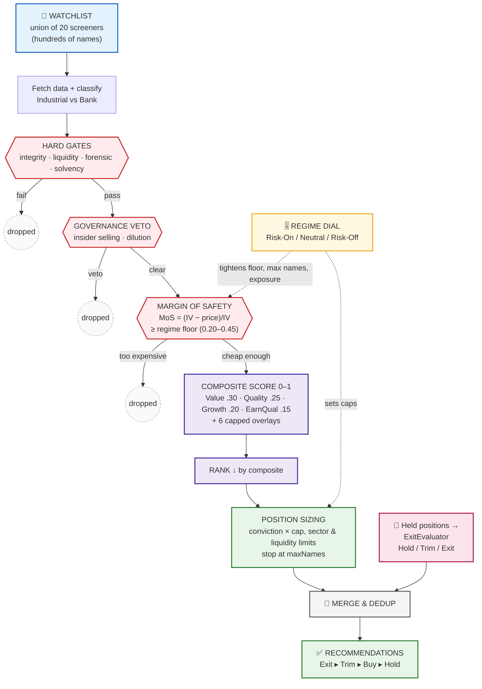

# Stock Selection Method — Illustration Brief

> A self-contained brief for illustrating how Autoscreener turns the **watchlist** into
> **Recommendations**. Hand this to Claude (or a designer) to produce a diagram. All
> thresholds are taken verbatim from `StockSelectionEngine.swift` so the illustration is
> accurate, not approximate.

---

## The one-sentence story

> The **watchlist** (a broad radar of hundreds of names) is poured into a funnel; **hard
> gates → governance → a regime-scaled margin-of-safety floor** strip out most of it; the
> handful of survivors are **scored and ranked**, then **position-sized** into a short list
> of **Recommendations**.

The dominant visual metaphor is a **funnel that narrows in stages** — wide at the top
(universe), a thin stream at the bottom (4–12 sized picks). Each stage is a filter that
removes names.

---

## Visual metaphor & layout guidance

- **Shape:** vertical funnel, top→bottom. Width of each band ∝ how many names survive it.
- **Stages narrow:** Universe (wide) → Hard Gates (sharp drop, "eliminates 50 %+") →
  Governance (binary chips fall away) → Margin-of-Safety (another sharp drop) →
  Scoring/Ranking (re-orders, doesn't remove) → Sizing (caps to a fixed count).
- **Left rail:** the *data* feeding each ticker (price, 5y financials, foreign flow, broker
  signal, governance, analyst coverage). Draw as inputs flowing into the funnel wall.
- **Right rail:** the **Regime dial** (Risk-On / Neutral / Risk-Off) — show it as a knob that
  *tightens or loosens the funnel's openings* (the MoS floor, max names, exposure).
- **Color coding:**
  - Red = a *kill* stage (gate fail, governance veto, MoS below floor) — names exit here.
  - Blue = a *ranking* stage (scoring) — no removal, just ordering.
  - Green = the final sized picks.
- **Two-sided ending:** the funnel output ("Buy picks") *merges* with a parallel small stream
  of "Sell/Trim/Hold verdicts" on names you already own → the unified **Recommendations
  inbox**. Held-position verdicts win over fresh buys for the same ticker.

---

## Stage-by-stage (with exact numbers)

### 0 · Universe — the Watchlist
- **What it is:** the union of **20 "bandar" screeners** (momentum, foreign flow, quality
  signals). A name joins if it matches ≥1 screener **and** clears both veto screeners
  (`liquidityFloor` + `intradayLiquidity`).
- **Illustration note:** widest band. Label "every name on the radar."

### 1 · Fetch data + classify archetype
- For each ticker pull `SecurityData`: price, ≥5y + TTM financials, daily bars, foreign flow,
  broker signal, governance, analyst coverage, seasonality.
- **Classify** into one of two tracks — they use different gates & valuation math:
  - **Industrial** → Graham math.
  - **Financial / bank** (sector = Keuangan) → P/B-vs-ROE math.
- Missing/insufficient data → dropped here.

### 2 · Hard gates (RED — biggest drop)
Any one failure eliminates the name.
| Gate | What it checks |
|---|---|
| Data Integrity | ≥5y financials, ≥200 trading days |
| Liquidity | average-daily-value floor, free-float floor |
| Forensic | CFO ≫ NI, receivables-vs-revenue gap, accruals ceiling |
| Solvency (industrial) / Capital Strength (bank) | current ratio & D/E floors / equity-to-assets (CAR proxy) |

### 3 · Governance veto (RED — binary)
Insider selling **or** heavy dilution flagged at concern severity → instant kill.

### 4 · Margin-of-Safety gate (RED — second big drop, **the core "is it cheap?" filter**)
- Compute **intrinsic value (IV)**:
  - Industrial → `min(Graham Number, NCAV per share)`, where
    Graham Number = `√(22.5 × EPS × BVPS)`.
  - Bank → `justified P/B × BVPS`, justified P/B = `(ROE − g) / (Ke − g)`.
- `MoS = (IV − price) / IV`.
- **Drop if `MoS < regime floor`.** The floor is set by the regime (see table below).

### 5 · Composite scoring (BLUE — re-orders, removes nothing)
Weighted 0–1 score. **Default (neutral) base weights:**
| Scorer | Weight | Reads |
|---|---|---|
| Graham Value | **0.30** | MoS vs Graham constant, P/B target, current ratio |
| Quality | **0.25** | ROE floor, margin consistency, earnings trend |
| Growth (Lynch / PEG) | **0.20** | PEG vs ceiling |
| Earnings Quality | **0.15** | CFO/NI ratio stability |

Then six **capped overlays** nudge the score (each clamped to ±cap):
| Overlay | Cap | Idea |
|---|---|---|
| Flow | **±0.05** | foreign net inflow + broker accumulation |
| Timing | **±0.05** | idiosyncratic return + MA(50) extension (reward, don't chase) |
| Relative Value | **±0.03** | cheaper than industry/sector on PE / PBV / EV-EBITDA |
| Seasonality | **±0.02** | current month's historical win-rate |
| Accumulation | **±0.03** | broker net imbalance + market-wide leaderboard |
| Consensus | **±0.03** | **fade the crowd** — haircut when sell-side is bullish |

`composite = clamp01(weighted_score + Σ overlays)` → **sort descending**.

### 6 · Position sizing (GREEN — produces the final list)
Walk the ranked survivors, sizing each:
```
weight = conviction × maxPositionPct
weight = min(weight, remaining total exposure)
weight = min(weight, remaining sector budget)
weight = min(weight, liquidity cap)
drop if weight < minWeightFloor
stop when maxNames or maxTotalExposure is hit
```
Output: `[Recommendation]` — ticker, composite score, IV, MoS, conviction, weight, audit trail.

---

## The Regime dial (right-rail knob)

A risk score from index valuation, market breadth, IDR trend, BI rate, and foreign flow
selects one of three policies. **The same watchlist yields stricter, smaller output in a
risk-off market.**

| Policy | Min MoS (floor) | Max exposure | Max position | Max sector | Max names | Tilt |
|---|---|---|---|---|---|---|
| **Risk-On** | 0.20 | 90 % | 12 % | 30 % | 12 | rewards Growth |
| **Neutral** | 0.30 | 65 % | 10 % | 25 % | 10 | balanced |
| **Risk-Off** | 0.45 | 35 % | 7 % | 20 % | 6 | quality + earnings |

*(These are the default-preset values; defensive/value/growth config presets shift the MoS
floors higher/lower and re-tilt the scorer weights.)*

---

## The two-sided ending — Recommendations inbox

The buy funnel above is only one half. Held positions run a **mirror** pipeline
(`ExitEvaluator`) on *current* data and emit **Hold / Trim / Exit** verdicts. The screen
merges both and **deduplicates so a held name's verdict beats a fresh buy signal.** Priority
order shown: **Exit → Trim → Buy → Hold.**

---

## Ready-to-render flow (Mermaid)



---

## Source of truth

| Stage | File · symbol |
|---|---|
| Universe / watchlist | `Features/Watchlist/WatchlistComposer.swift` · `compose` |
| Universe → engine | `Features/Selection/SelectionRunner.swift:98` · `watchlistUniverse()` |
| Whole pipeline | `Features/Selection/StockSelectionEngine.swift` · `run()` (~line 980) |
| Gates / scorers / valuators | same file, `SelectionProfile.industrial()` / `.financial()` |
| Regime policy | same file, `RegimeAssessor.assess` (~line 462), policies (~line 300) |
| Sell-side mirror | `Features/Selection/ExitEvaluator.swift` |
| Merge for the screen | `Features/Selection/RecommendationsViewModel.swift:97` · `merge` |
